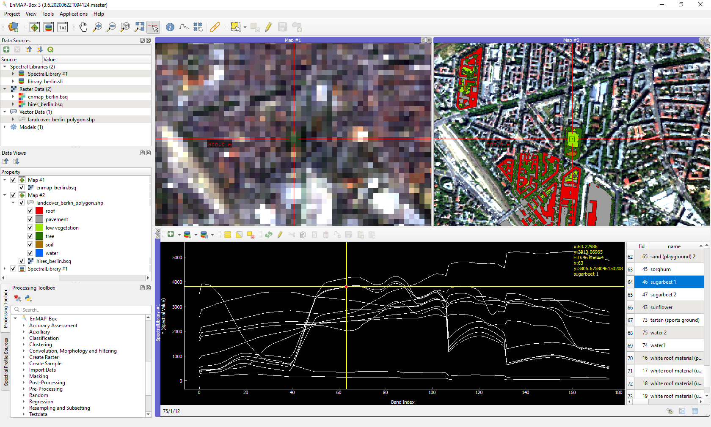

# EnMAP-Box 3


The EnMAP-Box is free and open source [QGIS Plugin ](https://www.qgis.org) to visualize and process remote sensing raster data. 
It is particularly developed to handle imaging spectroscopy data, as from the upcoming EnMAP sensor.



# Highlights:

* an easy-to-use graphical user interface for the visualization of vector and raster data sources in parallel and in spatially linked maps.

* collection and visualisation of spectral profiles spectral libraries. Spectral profiles can come from different sources, 
  e.g. raster images, field spectrometer or table-sheets.

* enhances the QGIS Processing Framework with many algorithms commonly used in
  remote sensing and imaging spectroscopy, e.g. support vector machines or random forest based raster classification, 
  regression, cluster approaches from the [scikit-learn](https://scikit-learn.org/stable/index.html) library.

* applications specific to imaging spectroscopy and the EnMAP program, e.g. a simulation of spectral profiles (IIVM), 
  atmospheric correction of EnMAP data, mapping of geological classes from EnMAP data and more...


Documentation: http://enmap-box.readthedocs.io

Git Repository: https://github.com/EnMAP-Box/enmap-box

## How to clone

Use the following commands to clone the EnMAP-Box and update its submodules:

### TL;DR:

Open a shell that allows to run git and python with PyQGIS, then run:

````bash

git clone --recurse-submodules git@github.com:EnMAP-Box/enmap-box.git
# alternatively, but not recommended, you can use https as well:
# git clone --recurse-submodules https://github.org:EnMAP-Box/enmap-box.git

cd enmap-box
git config --local include.path ../.gitconfig

# compile the EnMAP-Box resource files and download QGIS resource files to display icons  
python scripts/setup_repository.py

# start the EnMAP-Box
python enmapbox
````

### Detailed description

In the following we refer to the EnMAP-Box repository ``https://github.com/EnMAP-Box/enmap-box.git``
Replace it with your own EnMAP-Box fork from which you can create pull requests.

1. Ensure that your environment has git available and can start QGIS by calling `qgis`.
   You may use a bootstrap script as [scripts/OSGeo4W/qgis_env.bat](scripts/OSGeo4W/qgis_env.bat) (windows) or
   [scripts/qgis_env.bat](scripts/qgis_env.sh) (linux)
2. 
   The essential lines are:
    ````
    # on Linux: 
    export PYTHONPATH=/<qgispath>/share/qgis/python
    export LD_LIBRARY_PATH=/<qgispath>/lib
   
    ::on Windows: 
    set PYTHONPATH=c:\<qgispath>\python
    set PATH=C:\<qgispath>\bin;C:\<qgispath>\apps\<qgisrelease>\bin;%PATH% where <qgisrelease> should be replaced with the type of release you are targeting (eg, qgis-ltr, qgis, qgis-dev)

    # on macOS: 
    export PYTHONPATH=/<qgispath>/Contents/Resources/python
    set PATH=C:\<qgispath>\bin;C:\<qgispath>\apps\<qgisrelease>\bin;%PATH% where <qgisrelease> should be replaced with the type of release you are targeting (eg, qgis-ltr, qgis, qgis-dev)
    ````
   
2. Clone the EnMAP-Box repository.
   
    ````bash
    git clone git@github.com:EnMAP-Box/enmap-box.git
    ````
    
   You might also use the url `https://github.com/EnMAP-Box/enmap-box.git` instead. 
   However, ssh access is preferred.

3. Initialize submodules and pull their code, which is hosted in different repositories
    ````bash
    cd enmapbox
    git submodule update --init --remote --recursive
    ````

4. Once initialized, you can update submodules at any later point by:
    ````bash
    git submodule update --remote
    ````

    Of course cloning and submodule updating can be done in one step:
    ````bash
    
    git clone --recurse-submodules git@github.com:EnMAP-Box/enmap-box.git
    ````
    
    At any later point, you can pull in submodule updates by
    ````bash
    git submodule update --remote
    ````
    
    Doing so automatically when pulling the EnMAP-Box project can be enabled by:
    ````bash
    git config --set submodule.recurse true
    ````
    
    This setting (and maybe more in future) is already defined in the `.gitconfig`. 
    You can enable it for your local repository by:
    
    ````bash
    git config --local include.path ../.gitconfig
    ````
    
    If you have writing access to a submodule's repository, you can push changes upstream by:
    
    ````bash
    cd <submodule>
    git add .
    git commit -m "my changes"
    git push origin HEAD:master
    ````
    
    Finally, announce changes in a submodule to the EnMAP-Box (super) project by:
    ````bash
    cd <EnMAP-Box root>
    git add <submodule path>
    git commit -m "added submodule updates"
    git push
    ````
5. Ensure that PyQGIS is [available to your python enviroment](https://docs.qgis.org/3.22/en/docs/pyqgis_developer_cookbook/intro.html#running-custom-applications).
   (This means you can start a python shell and `import qgis`)
   
6. Compile resource files and download the test data. 
    ````bash
    python scripts/setup_repository.py
    ````
   
7. Now you can start the EnMAP-Box from shell by:
    ````bash
    python enmapbox
    ````


## How to contribute

Our online documentation at [http://enmap-box.readthedocs.io](http://enmap-box.readthedocs.io/en/latest/general/contribute.html) describes how you can support the development of the EnMAP-Box.

Please keep the code in a good shape. 

You might use flake8 to check if the EnMAP-Box code applies to the rules defined in 
``.flake8``:

````bash
flake8 
````

To check staged files only, run:
````bash
flake8 $(git status -s | grep -E '\.py$' | cut -c 4-)
````


## License

The EnMAP-Box is released under the GNU Public License (GPL) Version 3 or above. A copy of this licence can be found in 
the LICENSE.txt file that is part of the EnMAP-Box plugin folder and the EnMAP-Box repository, and also at
<http://www.gnu.org/licenses/>

Developing the EnMAP-Box under this license means that you can (if you want to) inspect and modify the source code and guarantees that you 
will always have access to an EnMAP-Box software that is free of cost and can be freely
modified.

## Support
You can get support in the following ways:

 -  Read the EnMAP-Box documentation [http://enmap-box.readthedocs.io](http://enmap-box.readthedocs.io)

 -  Open an issue with your question, bug report, feature request or other enhancement https://github.com/EnMAP-Box/enmap-box/issues/new
 
 -  Write us an email: [enmapbox@enmap.org](mailto:enmapbox@enmap.org)


