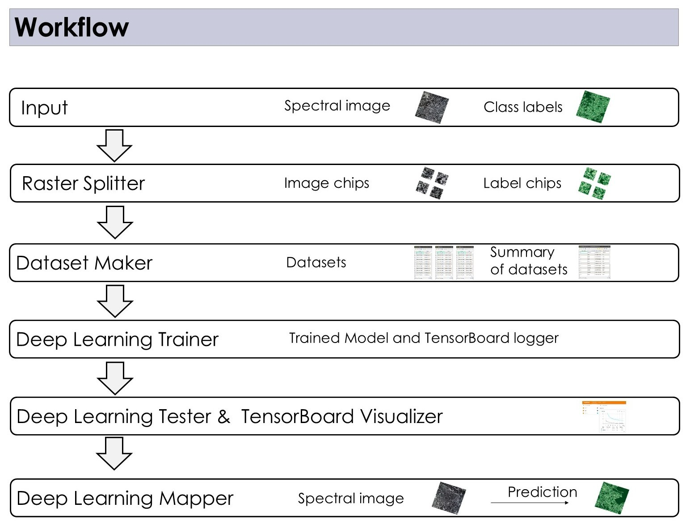

# Spectral Imaging Deep Learning Mapper (SpecDeepMap)

SpecDeepMap is a free and open source Application available in EnMAP-Box v3.16. The [EnMAP-Box](https://enmap-box.readthedocs.io/en/latest/index.html) is an open source [QGIS Plugin ](https://www.qgis.org).

The SpecDeepMap Application consists of six QGIS processing algorithms and is designed for deep learning based semantic segmentation tasks (pixel classification).  



# Highlights

* an easy-to-use graphical user interface for training a deep learning model for semantic segmentation

* SpecDeepMap algorithm take geographical data characteristics into account as well as higher dimensional data structure common for multi & hyperspectral raster images.

* Available Deep Learning architectures  U-Net, U-Net++, DeepLabV3+, and SegFormer with a variety of approximately 800 encoder backbones, such as ResNet-18 and -50, EfficientNet, MobileNet, ConvNext, and Swin-Transformer. 

* Integration of the foundation model backbones ResNet-18 and ResNet-50 trained for Sentinel-2 Top of Atmosphere Reflectance Imagery. These pretrained weights stemm from : Wang, Yi et al. “SSL4EO-S12: A Large-Scale Multi-Modal, Multi-Temporal Dataset for Self-Supervised Learning in Earth Observation.” ArXiv abs/2211.07044 (2022): n. pag. 

Documentation & Tutorial: https://enmap-box.readthedocs.io/en/latest/usr_section/application_tutorials/specdeepmap/tutorial_specdeepmap.html

Git Repository: https://github.com/EnMAP-Box/enmap-box/tree/main/enmapbox/apps/SpecDeepMap


# Install SpecDeepMap via QGIS

SpecDeepMap is available by default in EnMAP-Box from 3.16 onwards until further notice, and has to be installed via Miniforge/Conda.


# Install QGIS & SpecDeepMap via Miniforge/Conda (Cross-Platform)

The following steps show you how to install and run the EnMAP-Box with SpecDeepMap Application from a conda python environment. This enables cross-system platforms set up and enabling of GPU support.

Conda is a cross-platform package manager that allows install software in separated environments.

It is strongly recommended to use Miniforge, a minimal installer for conda specific to the `conda-forge<https://conda-forge.org/>`_ channel.
(If you nevertheless use miniconda instead of miniforge- make sure conda-forge channel is set to priority)

1. Download Miniforge Installer & Install Miniforge: You find the Installer here <https://conda-forge.org/download/>.
2. Open the Miniconda Prompt from your start menu.
3. Run the following command in 3.1 or 3.2. to create the specdeepmap environment:

3.1 Run the following command to create the SpecDeepMap environment with limited EnMAP-box function
```bash
conda env create -n specdeepmap --file=https://raw.githubusercontent.com/EnMAP-Box/enmap-box/main/enmapbox/apps/SpecDeepMap/conda_envs/enmapbox_specdeepmap.yml
```

or 

3.2 Run the following command to create the SpecDeepMap environment with full EnMAP-box function:

```bash
conda env create -n specdeepmap --file=https://raw.githubusercontent.com/EnMAP-Box/enmap-box/main/enmapbox/apps/SpecDeepMap/conda_envs/enmapbox_full_latest.yml
```

4. Activate the environment & start qgis:

4.1 activate environment
```bash
conda activate specdeepmap
```
4.2. start qgis and then open enmapbox in qgis interface via the enmapbox plugin icon
```bash
qgis
```

Once QGIS opens, you can access SpecDeepMap via the EnMAP-Box processing algorithm menu.

## Install QGIS & SpecDeepMap with GPU Support (Optional)

If you have a CUDA-capable GPU, you can configure SpecDeepMap to use GPU acceleration.

### Step 1: Activate the Environment

```bash
conda activate specdeepmap
```

### Step 2: Install PyTorch with CUDA (e.g. CUDA 12.4)

This download is large (\~4.5 GB).

```bash
pip install torch==2.6.0 torchvision==0.21.0 torchaudio==2.6.0 --index-url https://download.pytorch.org/whl/cu124 --force-reinstall
```

Note: It is also possible to setup  CUDA via the OSGeo4W Shell on Windows. First, install the CUDA Toolkit: [https://developer.nvidia.com/cuda-downloads](https://developer.nvidia.com/cuda-downloads), then run Step 2 in the OSGeo4W Shell.
For more details on how to set up GPU via OsGeo4W Shell see GEO-SAM installation here: [https://geo-sam.readthedocs.io/en/latest/installation.html](https://geo-sam.readthedocs.io/en/latest/installation.html)

# Timeless Recovery Environment with Explicit Python Package Versions of Original Release (CPU/GPU) 

If SpecDeepMap breaks due to package updates or compatibility issues, you can recover a working environment using pre-defined environment files.

These files ensure full reproducibility by pinning exact package versions of the release python environment of SpecDeepMap which ensures an always functional version of the SpecDeepMap application.

### CPU-Only Environment

```bash
conda env create -n specdeepmap_cpu_time_capsul --file=https://raw.githubusercontent.com/EnMAP-Box/enmap-box/main/enmapbox/apps/SpecDeepMap/conda_envs/specdeepmap_cpu_time_capsul.yml
```

### GPU Environment (CUDA 12.4) - tested on Windows

```bash
conda env create -n specdeepmap_gpu_time_capsul --file=https://raw.githubusercontent.com/EnMAP-Box/enmap-box/main/enmapbox/apps/SpecDeepMap/conda_envs/specdeepmap_gpu_time_capsul.yml
```

If you want to use a newer CUDA version or have problems installing the pytorch wheel for GPU, you can first create the CPU time capsul environment, then re-install PyTorch using the appropriate pip install command for cuda enabling (as shown in Step 2: Install PyTorch with CUDA (e.g. CUDA 12.4)). If you use a newer cuda version, keep in mind that it has to be compaitbel with pytorch/torch=2.6.0.
Activate environment using conda activate specdeepmap_cpu_time_capsul or conda activate specdeepmap_cgu_time_capsul 

# License

The SpecDeepMap is released under the GNU Public License (GPL) Version 3 or above. A copy of this licence can be found in
the LICENSE.txt file that is part of the SpecDeepMap folder here [https://github.com/EnMAP-Box/enmap-box/blob/main/enmapbox/apps/SpecDeepMap/LICENSE_specdeepmap.md] 

The SpecDeepMap application partially uses code from TorchGeo, originally authored by Adam Stewart and developed and licenced by Microsoft Corporation with a MIT license. 
TorchGeo is licensed under the MIT License, full license with Notice here [https://github.com/EnMAP-Box/enmap-box/blob/main/enmapbox/apps/SpecDeepMap/NOTICE.md]

# Contact 

Main developer: 

* Leon-Friedrich Thomas
* email: leon-friedrich.thomas@helsinki.fi


